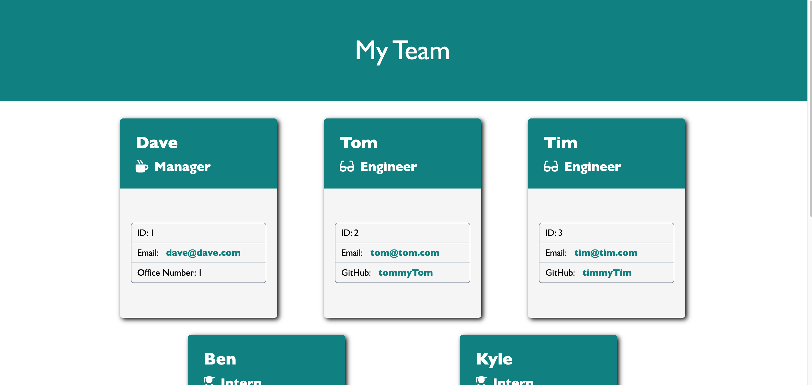

  # Team Profile Generator

  
  
  ## Table of Contents
  * [Description](#description)
  * [Technologies used](#technologies-used)
  * [Installation](#installation)
  * [How to Use](#How-to-use)
  * [Demo](#Demo)
  * [Test](#test)
  * [Github Link](#github-link)
    
  ## Description
  This is a team profile generator that a user can use to create a simple html page to display their team!

  ## Technologies used
  * HTML
  * CSS
  * JavaScript
  * Node.js
  * Inquirer.js
  * Jest

  ## Installation
  After pulling the files from this github repo, use the command line to navigate to where you saved the repo. Once there, run `npm install` to install our dependencies. After those have been installed, use the command `node index.js` to start the application.

  ## How to Use
  Once the application has started in the terminal, users can add a `Manager`, `Engineer`, or an `Intern`, or finish with the app. If an employee is selected, users will then be prompted to input that employee's name, id, email, and whatever else is necessary for that kind of employee. Once finished, users will be brought back to select a new employee type to enter or to finish. Once finished, the completed HTML file will be saved to the `dist` folder of the application.

  ## Demo
  Check out the demo video at the link below!
  
  https://youtu.be/dgL6TtDHMB0

  ## Test
  From the command line, run the command `npm run test` at the root of the application to run the tests.

  ## Github Link
  https://github.com/simmonsW/team-profile-generator
